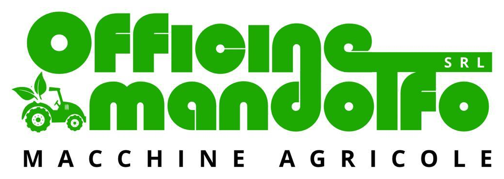

# Officine Mandolfo srl - Sito Web Ufficiale



Benvenuti nel repository del nuovo sito web per **Officine Mandolfo srl**, azienda specializzata nella vendita, assemblaggio e assistenza di macchine agricole professionali. 

Il sito è stato progettato per offrire un'esperienza utente moderna, fluida e altamente responsiva, con l'obiettivo di valorizzare il catalogo aziendale e facilitare il contatto rapido (via WhatsApp, Telefono, Email) o in officina.

## 🌟 Caratteristiche Principali
- **Catalogo Interattivo**: Navigazione filtrabile per categorie (motozappe, trinciatutto, decespugliatori, motoseghe, trattorini, ecc.) con oltre 50 articoli disponibili.
- **Specifiche Tecniche Dettagliate**: Ogni prodotto è dotato di una modale interattiva (`ProductModal.jsx`) che espande le specifiche chiave per l'utente, implementata con schede tecniche precise per ogni mezzo.
- **Configuratore Animato**: Una sezione dedicata alle opzioni personalizzate e ai servizi "su misura" offerti dall'officina.
- **Design Moderno e Animazioni Fluide**: Utilizzo intensivo di `GSAP` e `ScrollTrigger` per animare l'ingresso dei componenti (schede, hero, footer) allo scrolling.
- **Informativa Privacy e Cookie Integrata**: Modale dedicata per adempiere alle normative vigenti.

## 🛠️ Stack Tecnologico
- **Framework**: [React 19](https://react.dev/) + [Vite](https://vitejs.dev/)
- **Styling**: CSS Vanilla Avanzato (con variabili custom e layout Grid/Flexbox ottimizzato per il mobile)
- **Animazioni**: [GSAP](https://gsap.com/) (GreenSock Animation Platform)

## 🚀 Avvio Rapido (Sviluppo Locale)

Clona il repository e installa le dipendenze:

```bash
npm install
# oppure
yarn install
```

Avvia il server di sviluppo (Vite):

```bash
npm run dev
```

Apri `http://localhost:5173` nel tuo browser per visualizzare il progetto.

## 🏗️ Build per la Produzione

Per compilare la versione ottimizzata del sito, esegui:

```bash
npm run build
```
I file compilati saranno disponibili nella cartella `dist/`, pronti per il deploy su piattaforme come Vercel, Netlify o hosting statico standard.

---

*Progetto web realizzato a cura di Simana.*
